<div align="center">

#  Smishing Forecast

### *Self-Evolving AI-Powered Smishing Defense & Forecast System*

[](https://www.python.org/)
[](https://streamlit.io/)
[](https://huggingface.co/)
[](LICENSE)


</div>

---

## 👥 Team Members

| 이름 | 이메일 |
|------|--------|
| 조은경 | gracech0961@gmail.com |
| 안성민 | tjdals2299@gmail.com |
| 황동현 | myjewel29@naver.com |
| 황선우 | eddiehwang125@gmail.com |

---

## 📖 프로젝트 소개

AI 기반 자가 진화형 스미싱 탐지 및 방어 시스템입니다. 최신 뉴스를 기반으로 공격 시나리오를 예측하고, 적대적 학습(Adversarial Training)을 통해 실시간으로 방어력을 강화합니다.

- 사회적 이슈를 실시간으로 수집하여 스미싱 공격자가 악용할 수 있는 위협 시나리오를 **선제적으로 예측 (Red Team)**
- 생성된 공격에 대해 즉각적으로 방어 가능한 **AI 가중치(Digital Vaccine)를 실시간 생성 및 배포 (Blue Team)**
- SOC, 금융기관, 통신사의 사기 대응 전문성을 고도화하여 **디지털 취약계층을 위한 기술적 안전망** 구축

---

## ✨ 주요 기능

### 🌐 Global Security Monitor (실시간 뉴스 인텔리전스) ✨ New
- **트렌드 기반 수집**: 구글 뉴스 RSS `주요 뉴스`, `경제`, `사회` 섹션에서 현재 가장 화제인 기사를 **키워드 없이** 자동 수집
- **보조 수집**: 네이버 뉴스 API를 통한 사회적 맥락 키워드 기반 보완 수집
- **Incremental Merge**: 링크 및 제목 기반 중복 제거 후 신규 항목만 증분 저장
- **동기화 피드백**: 사이드바의 "마지막 동기화" 시간과 신규 추가 건수 Toast 알림

### 🔴 Red Team (공격 시뮬레이션)
- **뉴스 기반 시나리오 기획**: LLM 기반 Planner가 사회적 맥락을 분석하여 3종의 공격 전략 도출
- **GPT-4o 기반 공격 문구 생성**: 자연스럽고 교묘한 스미싱 메시지 자동 생성
- **스텔스 모드**: URL, 전화번호, 의심 키워드를 제거한 은밀한 공격 시뮬레이션

### 🔵 Blue Team (방어 및 분석)
- **RoBERTa 기반 실시간 탐지**: `klue/roberta-base` Fine-tuned 모델 활용
- **지능형 위협 프로파일링**: 공격 의도, 위협 등급, 법적 위반 소지 분석 (SOC Standard)
- **자가 진화 (Stability Learning)**: 파괴적 망각을 최소화한 Replay Buffer 학습으로 실시간 방어력 강화
- **전문 보안 리포트 발간**: SOC 분석가용 IoC(침해 지표)를 포함한 PDF 분석 보고서 자동 생성

### 🖥️ Operation Monitoring (운영 모니터링) ✨ New
- **Digital Vaccine Hub**: 현재 배포된 모델 가중치 최신화 상태 및 업데이트 일시 표시
- **Intelligence Source**: 확보된 위협 피드 건수 및 기사 선택 인터페이스
- **사이드바 메트릭**: 분석된 시나리오 수, 탐지 로그 수를 고대비 카드 UI로 표시

### 💾 데이터 관리
- **SQLite 기반 영구 저장**: 뉴스, 공격 시나리오, 분석 결과, 보고서 자동 저장
- **Supabase 연동 지원**: 클라우드 데이터베이스 옵션 제공 (선택 사항)

---

## 🚀 설치 및 실행

### 1. 저장소 클론
```bash
git clone https://github.com/DongHyun925/SmishingForecast.git
cd SmishingForecast
git checkout final
```

### 2. 의존성 설치
```bash
pip install -r requirements.txt
```

### 3. 환경 변수 설정
`.env.example`을 `.env`로 복사하고 API 키를 입력하세요:
```bash
cp .env.example .env
```

`.env` 파일 내용:
```
OPENAI_API_KEY=your_actual_openai_api_key

# Naver Search API (For News Crawling)
NAVER_CLIENT_ID=your_naver_client_id
NAVER_CLIENT_SECRET=your_naver_client_secret

# Supabase (Optional, for Cloud DB mode)
# SUPABASE_URL=your_supabase_url
# SUPABASE_KEY=your_supabase_key
```

### 4. 사전 학습된 모델 다운로드 (선택 사항)
사전 학습된 RoBERTa 모델을 사용하려면:
```bash
# Hugging Face에서 다운로드
# https://huggingface.co/donghyun95/smishing-detection-roberta-base
```

또는 프로그램 실행 시 `klue/roberta-base` 기본 모델로 시작 가능합니다.

### 5. 애플리케이션 실행
```bash
streamlit run app.py
```

브라우저에서 `http://localhost:8501`로 접속하세요.

---

## 📁 프로젝트 구조

```
Hackathon_Smishing/
├── app.py                      # Streamlit 메인 애플리케이션 (대시보드 UI)
├── database_manager.py         # 데이터베이스 관리 (SQLite / Supabase 자동 전환)
├── requirements.txt            # Python 의존성
├── .env.example               # 환경 변수 템플릿
│
├── src/                       # 핵심 모듈
│   ├── crawler.py            # 뉴스 크롤러 (Google RSS Trending + Naver API)
│   ├── planner.py            # 공격 시나리오 기획 (Red Team, LLM 기반)
│   ├── generator.py          # 공격 문구 생성 (GPT-4o)
│   ├── intent_analyzer.py    # 의도 분석 및 위협 프로파일링 (Blue Team)
│   ├── detector.py           # 스미싱 탐지 모델 (RoBERTa Fine-tuned)
│   ├── trainer.py            # 자가 진화 학습 (Replay Buffer)
│   ├── report_generator.py   # 보안 리포트 생성 (PDF/Markdown)
│   └── utils.py              # 유틸리티 함수 (JSONL 로드 등)
│
├── data/                      # 데이터 저장소 (절대 경로 보장)
│   └── scenario_bank.json    # 생성된 시나리오 뱅크
│                              # (smishing_context_data.jsonl은 동기화 시 자동 생성)
│
├── models/                    # 학습된 모델 가중치
│   └── smishing_detector_model.pth  # Fine-tuned RoBERTa 가중치
│
└── scripts/                   # 유틸리티 스크립트
    └── deploy_model.py       # Hugging Face Hub 배포 스크립트
```

---

## 🎯 사용 방법

### 1. 뉴스 인텔리전스 동기화 ✨ New
- 사이드바의 **[🔄 실시간 위협 정보 동기화 (Crawl)]** 버튼 클릭
- 구글 뉴스 및 네이버에서 트렌딩 기사를 자동 수집
- 동기화 완료 후 신규 추가 건수가 Toast로 표시됨

### 2. 공격 시나리오 생성
1. 사이드바의 **Intelligence Source** 드롭다운에서 분석할 기사 선택
2. **[공격 시나리오 기획 (3종)]** 버튼 클릭
3. 3가지 전략 중 하나를 선택
4. **[이 전략으로 공격 문자 생성]** 버튼 클릭

### 3. 방어 분석
- 오른쪽 패널에서 자동으로 **의도 분석** 및 **실시간 탐지** 수행
- 탐지 점수가 낮을 경우 **[자가 진화 시작]** 버튼(Adversarial Training)으로 즉시 재학습

### 4. 보안 리포트 생성
- **[리포트 생성 하기]** 버튼 클릭
- Markdown 미리보기 또는 PDF 다운로드

---

## 🧠 핵심 기술

### 시스템 아키텍처

```mermaid
flowchart TB
    subgraph UI["🖥️ User Interface (Control Center)"]
        DASH["Security Dashboard\n(Streamlit)"]
    end

    subgraph RED["🔴 Red Team: 공격 시뮬레이션"]
        direction LR
        RSS["Google News RSS\n+ Naver API"] --> CRAWLER["Crawler\n(feedparser: RSS 파싱\nBS4: 원문 크롤링)"]
        CRAWLER --> PLANNER["Attack Planner\n(GPT-4o 기반\n3종 전략 수립)"]
        PLANNER --> GENERATOR["Attack Generator\n(GPT-4o)\n스미싱 문자 생성"]
    end

    subgraph BLUE["🔵 Blue Team: 지능형 방어"]
        direction LR
        DETECTOR["Smishing Detector\n(klue/roberta-base\nFine-tuned)"]
        ANALYZER["Intent Analyzer\n(GPT-4o 기반\nSOC 위협 프로파일링)"]
        TRAINER["Self-Evolution Trainer\n(Adversarial Training\n+ Replay Buffer)"]
        DETECTOR --> ANALYZER
        TRAINER -- "Model Update" --> DETECTOR
    end

    subgraph DATA["💾 Data & Reporting"]
        DB["Database Manager\n(SQLite / Supabase)"]
        SMDB[("smishing_db")]
        REPORT["Report Generator\n(PDF / Markdown)"]
        DB <--> SMDB
        DB --> REPORT
    end

    DASH -- "①뉴스 선택" --> CRAWLER
    DASH -- "②시뮬레이션 실행" --> PLANNER
    GENERATOR -- "공격 페이로드 전송" --> DETECTOR
    DETECTOR -- "미탐지 시 재학습" --> TRAINER
    ANALYZER -- "분석 데이터 저장" --> DB
    DB -- "③결과 조회" --> DASH
    REPORT -- "④PDF 리포트 제공" --> DASH
```



### AI 모델
- **텍스트 생성**: OpenAI GPT-4o (공격 시나리오 및 분석)
- **시작 모델**: `klue/roberta-base` + GPT-4o 합성 데이터 100건으로 Fine-tuned된 가중치 (`smishing_detector_model.pth`)
- **학습 방식**: Adversarial Training + Replay Buffer (자가 진화)

### 뉴스 크롤링 ✨ New
- **Primary**: Google News RSS (주요뉴스 / 경제 / 사회 섹션, 트렌딩 자동 수집)
- **Secondary**: Naver News API (사회적 맥락 키워드 검색)
- **Full-Text**: BeautifulSoup4 (on-demand 기사 원문 수집)

### 데이터베이스
- **로컬**: SQLite3 (`smishing_db.db`)
- **클라우드**: Supabase (선택 사항)

### 프레임워크
- **UI**: Streamlit
- **ML**: PyTorch, Transformers (Hugging Face)

---

## 📊 데이터베이스 스키마

### `news_articles` (뉴스 기사)
- 뉴스 제목, 내용, 출처, 날짜, 카테고리

### `intents` (공격 시나리오)
- 전략명, 심리 기제, 논리, 메타데이터

### `attack_logs` (공격 로그)
- 생성된 메시지, 탐지 점수, 사용 모델, 타임스탬프

### `security_reports` (보안 리포트)
- 시나리오명, 뉴스 제목, 리포트 텍스트, PDF 데이터

---

## 🔬 모델 성능

### 초기 모델 (Pre-trained `klue/roberta-base`)
- **Precision**: 0.50 (Baseline)
- **Recall**: 1.00 (High False Positive)
- **F1-Score**: 0.67

### 진화 후 모델 (Self-Evolved)
- **Precision**: 0.50 → **1.00**
- **Recall**: 1.00 → **1.00**
- **F1-Score**: 0.67 → **1.00**

*(※ 위 성능은 합성 데이터셋 100건에 대한 평가 결과입니다. 학습 데이터와 동일한 생성 모델(GPT-4o)로 만들어진 데이터이기에 높은 성능이 측정되었으며, 실제 스미싱 문자(Wild/Real-world)에 대해서는 성능 하락(Overfitting to Synthetic Distribution)이 발생할 수 있습니다.)*

---

## 🚀 Hugging Face Hub 배포

학습된 모델을 공유하려면:
```bash
# Hugging Face CLI 로그인
huggingface-cli login

# 모델 업로드
python scripts/deploy_model.py
```

배포된 모델: [donghyun95/smishing-detection-roberta-base](https://huggingface.co/donghyun95/smishing-detection-roberta-base)

---

## ⚠️ 주의사항

1. **윤리적 사용**: 이 시스템은 교육 및 연구 목적으로만 사용하세요.
2. **API 비용**: OpenAI API 사용량에 따라 비용이 발생할 수 있습니다.
3. **데이터 보안**: `.env` 파일은 절대 공개 저장소에 업로드하지 마세요.

---

## 📝 라이선스

MIT License

---

## 🙏 감사의 말

- **KLUE Team**: 한국어 RoBERTa 모델 제공
- **Hugging Face**: 모델 호스팅 및 인프라 지원
- **OpenAI**: GPT-4o API 제공
- **Google / Naver**: 뉴스 RSS 및 검색 API 제공

---

**📧 문의**: gracechoek@github.com  
**🔗 Repository**: https://github.com/DongHyun925/SmishingForecast
