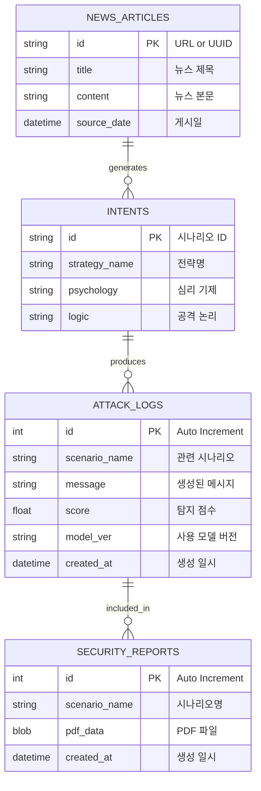
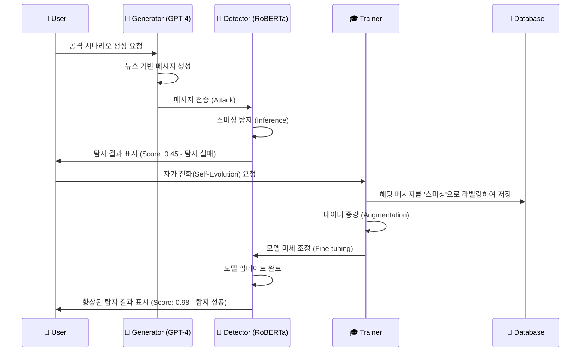

# 🔮 Smishing Forecast - 시스템 아키텍처 (Mermaid)

이 파일은 시스템의 전체 구조를 시각화하기 위한 Mermaid 다이어그램 코드를 포함하고 있습니다.
GitHub README나 Markdown 뷰어에서 렌더링하여 확인할 수 있습니다.

## 1. 전체 시스템 흐름도 (System Flowchart)

```mermaid
graph TD
    %% 스타일 정의
    classDef red fill:#ffcccc,stroke:#ff0000,stroke-width:2px;
    classDef blue fill:#cce5ff,stroke:#0066cc,stroke-width:2px;
    classDef db fill:#e0e0e0,stroke:#666666,stroke-width:2px,stroke-dasharray: 5 5;
    classDef user fill:#fff2cc,stroke:#d6b656,stroke-width:2px;

    %% 외부 데이터 소스
    subgraph External_Data [외부 데이터 소스]
        NewsRSS[📰 Google News RSS]
    end

    %% Red Team (공격 시뮬레이션)
    subgraph Red_Team [🔴 Red Team: 공격 시뮬레이션]
        Crawler[🕷️ Crawler]:::red
        Planner[🧠 Attack Planner]:::red
        Generator[💬 Attack Generator (GPT-4)]:::red
        
        NewsRSS --> Crawler
        Crawler -->|뉴스 데이터| Planner
        Planner -->|공격 시나리오 (Intent)| Generator
        Generator -->|스미싱 메시지 생성| Blue_Team
    end

    %% Blue Team (방어 및 분석)
    subgraph Blue_Team [🔵 Blue Team: 방어 및 분석]
        Detector[🛡️ Smishing Detector (RoBERTa)]:::blue
        Analyzer[🔍 Intent Analyzer]:::blue
        Trainer[🎓 Self-Evolution Trainer]:::blue
        
        Generator --> Detector
        Detector -->|탐지 결과 (Score)| Analyzer
        Analyzer -->|의도 분석 결과| DB_Manager
        
        %% 자가 진화 루프
        Detector --"탐지 실패 (Low Score)"--> Trainer
        Trainer -->|재학습 (Fine-tuning)| Detector
    end

    %% Database & Reporting
    subgraph Storage_Reporting [💾 Data & Reporting]
        DB_Manager[(🗄️ Database Manager)]:::db
        Reporter[📄 Report Generator]:::db
        
        DB_Manager <-->|Store/Retrieve| SQLite[(danjwe.db)]:::db
        DB_Manager --> Reporter
    end

    %% 사용자 인터랙션
    subgraph User_Interface [👤 User Interface (Streamlit)]
        Dashboard[🖥️ Security Dashboard]:::user
        
        Dashboard -->|1. 뉴스 선택| Crawler
        Dashboard -->|2. 공격 실행| Planner
        Dashboard -->|3. 리포트 요청| Reporter
        Reporter -->|PDF 다운로드| Dashboard
    end
```

## 2. 데이터베이스 스키마 (ER Diagram)



## 3. 시퀀스 다이어그램 (Sequence Diagram) - 자가 진화 프로세스


